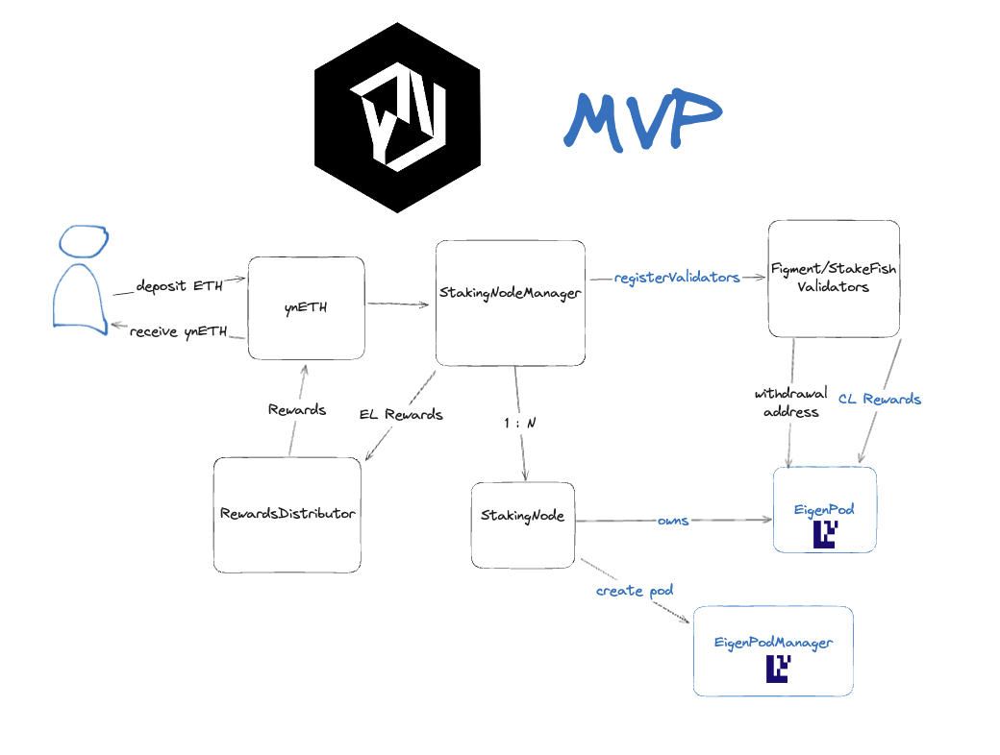

## YieldNest Protocol

The first version of YieldNest protocol supports ETH deposits and allows staking those funds with validators, and then restaking within eigenlayer utlizing one or more eigenpods.

The first version does not utilize an oracle yet for beacon chain balances and relies instead on measuring ETH inflows and balances of eigenpods.

This ingores for the time being the impact of slashing penalties until withdrawals are supported and validator state is submitted on-chain.

The Execution Layer rewards are forwarded to the Execution Layer receiver, and the Consensus Layer rewards are forwarded to the Eigenpods themselves.

Delegation and withdrawals are not yet supported.

### System diagram

All contracts utilize TransparentUpgradeableProxy.sol except for StakingNode that utilizes Beacon Proxy.

ynETH accepts ETH deposits, and allows the StakingNodeManager to utilize the ETH deposits when it enrolls validators.

The ETH is staked within the Ethereum deposit staking contract accordingly.

All Validator fields and actual validators are obtained using the Figment permissioned API as documented here:

https://docs.figment.io/reference/validator-api-overview
 
 Stake.fish integration: TBD.

A StakingNode is created for each EigenPod in the system (1:1 relationship in terms of owner and Eigenpod).

### Implementation state for audit preview

Test coverage is minimal. Final tests will utilize forge predominantly.

Bugs are likely present, most testing was done on testnet.

