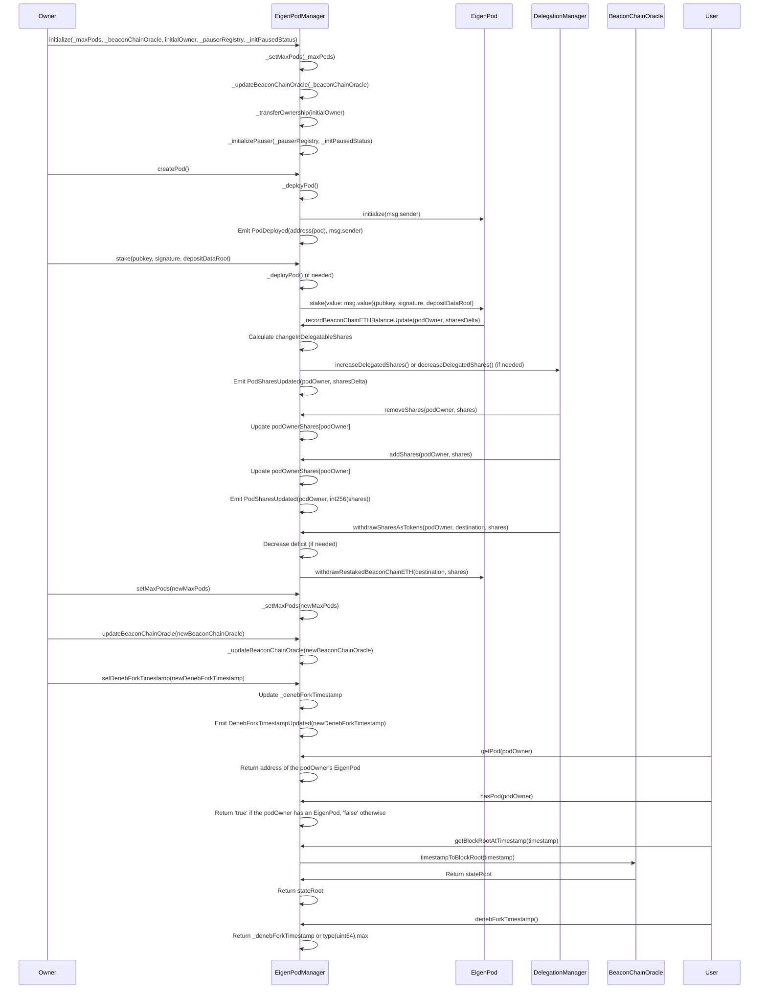
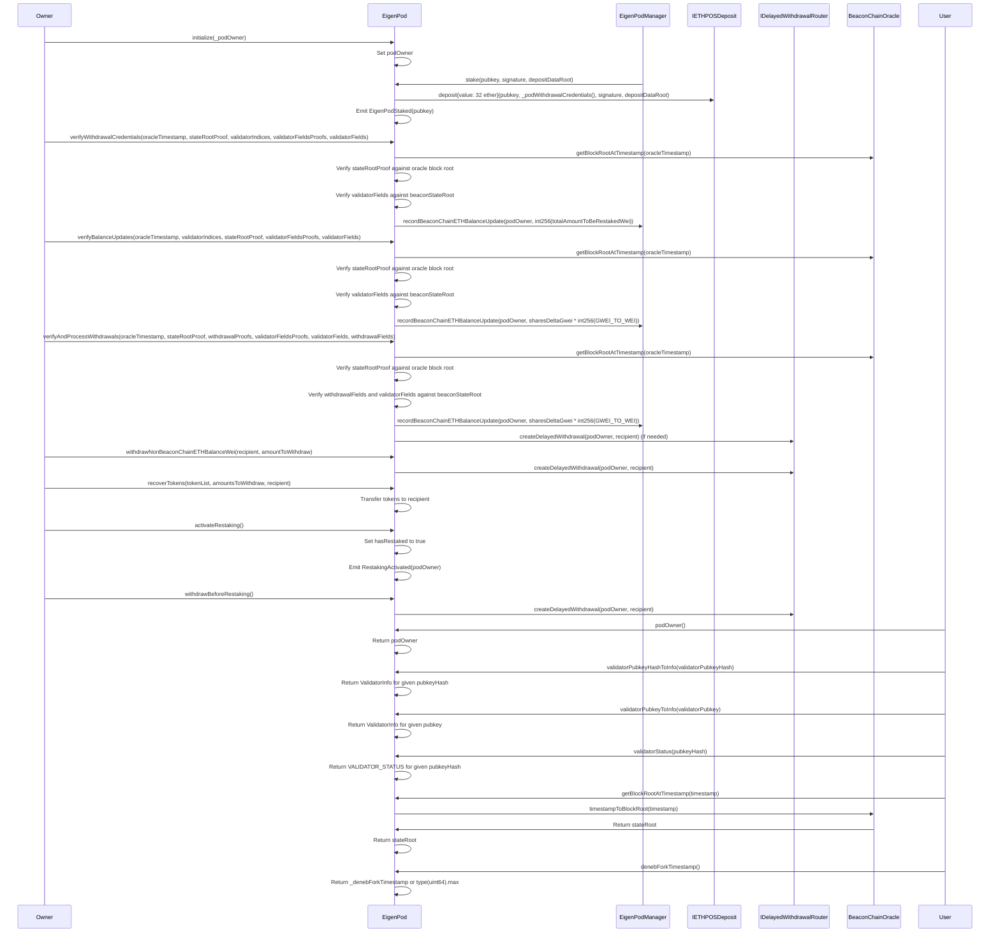
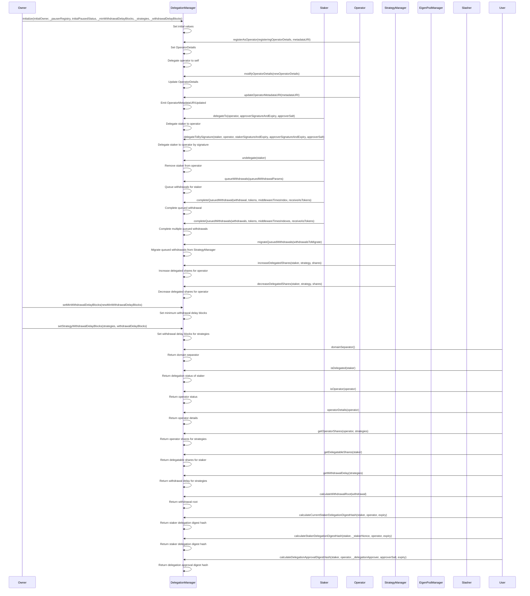
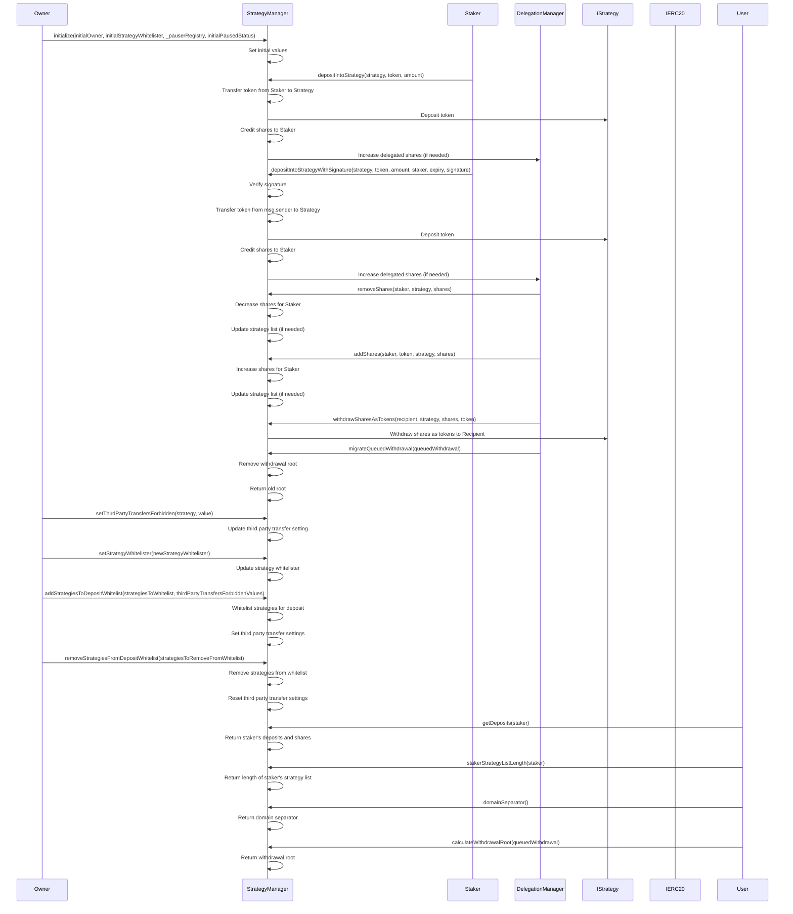

`EigenPodManager.sol`

```mermaid
sequenceDiagram
    participant Owner as Owner
    participant Contract as EigenPodManager
    participant Pod as EigenPod
    participant DM as DelegationManager
    participant BCOracle as BeaconChainOracle

    %% Initialization %%
    Owner->>Contract: initialize(_maxPods, _beaconChainOracle, initialOwner, _pauserRegistry, _initPausedStatus)
    Contract->>Contract: _setMaxPods(_maxPods)
    Contract->>Contract: _updateBeaconChainOracle(_beaconChainOracle)
    Contract->>Contract: _transferOwnership(initialOwner)
    Contract->>Contract: _initializePauser(_pauserRegistry, _initPausedStatus)

    %% Create Pod %%
    Owner->>Contract: createPod()
    Contract->>Contract: _deployPod()
    Contract->>Pod: initialize(msg.sender)
    Contract->>Contract: Emit PodDeployed(address(pod), msg.sender)

    %% Stake %%
    Owner->>Contract: stake(pubkey, signature, depositDataRoot)
    Contract->>Contract: _deployPod() (if needed)
    Contract->>Pod: stake{value: msg.value}(pubkey, signature, depositDataRoot)

    %% Record Beacon Chain ETH Balance Update %%
    Pod->>Contract: recordBeaconChainETHBalanceUpdate(podOwner, sharesDelta)
    Contract->>Contract: Calculate changeInDelegatableShares
    Contract->>DM: increaseDelegatedShares() or decreaseDelegatedShares() (if needed)
    Contract->>Contract: Emit PodSharesUpdated(podOwner, sharesDelta)

    %% Remove Shares %%
    DM->>Contract: removeShares(podOwner, shares)
    Contract->>Contract: Update podOwnerShares[podOwner]

    %% Add Shares %%
    DM->>Contract: addShares(podOwner, shares)
    Contract->>Contract: Update podOwnerShares[podOwner]
    Contract->>Contract: Emit PodSharesUpdated(podOwner, int256(shares))

    %% Withdraw Shares As Tokens %%
    DM->>Contract: withdrawSharesAsTokens(podOwner, destination, shares)
    Contract->>Contract: Decrease deficit (if needed)
    Contract->>Pod: withdrawRestakedBeaconChainETH(destination, shares)

    %% Set Max Pods %%
    Owner->>Contract: setMaxPods(newMaxPods)
    Contract->>Contract: _setMaxPods(newMaxPods)

    %% Update Beacon Chain Oracle %%
    Owner->>Contract: updateBeaconChainOracle(newBeaconChainOracle)
    Contract->>Contract: _updateBeaconChainOracle(newBeaconChainOracle)

    %% Set Deneb Fork Timestamp %%
    Owner->>Contract: setDenebForkTimestamp(newDenebForkTimestamp)
    Contract->>Contract: Update _denebForkTimestamp
    Contract->>Contract: Emit DenebForkTimestampUpdated(newDenebForkTimestamp)

    %% Get Pod %%
    User->>Contract: getPod(podOwner)
    Contract->>Contract: Return address of the podOwner's EigenPod

    %% Has Pod %%
    User->>Contract: hasPod(podOwner)
    Contract->>Contract: Return 'true' if the podOwner has an EigenPod, 'false' otherwise

    %% Get Block Root At Timestamp %%
    User->>Contract: getBlockRootAtTimestamp(timestamp)
    Contract->>BCOracle: timestampToBlockRoot(timestamp)
    BCOracle->>Contract: Return stateRoot
    Contract->>Contract: Return stateRoot

    %% Deneb Fork Timestamp %%
    User->>Contract: denebForkTimestamp()
    Contract->>Contract: Return _denebForkTimestamp or type(uint64).max
```
---
`EigenPod.sol`

```mermaid
sequenceDiagram
    participant Owner as Owner
    participant Contract as EigenPod
    participant EPManager as EigenPodManager
    participant ETHPOS as IETHPOSDeposit
    participant DWRouter as IDelayedWithdrawalRouter
    participant BCOracle as BeaconChainOracle

    %% Initialization %%
    Owner->>Contract: initialize(_podOwner)
    Contract->>Contract: Set podOwner

    %% Stake %%
    EPManager->>Contract: stake(pubkey, signature, depositDataRoot)
    Contract->>ETHPOS: deposit{value: 32 ether}(pubkey, _podWithdrawalCredentials(), signature, depositDataRoot)
    Contract->>Contract: Emit EigenPodStaked(pubkey)

    %% Verify Withdrawal Credentials %%
    Owner->>Contract: verifyWithdrawalCredentials(oracleTimestamp, stateRootProof, validatorIndices, validatorFieldsProofs, validatorFields)
    Contract->>BCOracle: getBlockRootAtTimestamp(oracleTimestamp)
    Contract->>Contract: Verify stateRootProof against oracle block root
    Contract->>Contract: Verify validatorFields against beaconStateRoot
    Contract->>EPManager: recordBeaconChainETHBalanceUpdate(podOwner, int256(totalAmountToBeRestakedWei))

    %% Verify Balance Updates %%
    Owner->>Contract: verifyBalanceUpdates(oracleTimestamp, validatorIndices, stateRootProof, validatorFieldsProofs, validatorFields)
    Contract->>BCOracle: getBlockRootAtTimestamp(oracleTimestamp)
    Contract->>Contract: Verify stateRootProof against oracle block root
    Contract->>Contract: Verify validatorFields against beaconStateRoot
    Contract->>EPManager: recordBeaconChainETHBalanceUpdate(podOwner, sharesDeltaGwei * int256(GWEI_TO_WEI))

    %% Verify And Process Withdrawals %%
    Owner->>Contract: verifyAndProcessWithdrawals(oracleTimestamp, stateRootProof, withdrawalProofs, validatorFieldsProofs, validatorFields, withdrawalFields)
    Contract->>BCOracle: getBlockRootAtTimestamp(oracleTimestamp)
    Contract->>Contract: Verify stateRootProof against oracle block root
    Contract->>Contract: Verify withdrawalFields and validatorFields against beaconStateRoot
    Contract->>EPManager: recordBeaconChainETHBalanceUpdate(podOwner, sharesDeltaGwei * int256(GWEI_TO_WEI))
    Contract->>DWRouter: createDelayedWithdrawal(podOwner, recipient) (if needed)

    %% Withdraw Non-Beacon Chain ETH Balance %%
    Owner->>Contract: withdrawNonBeaconChainETHBalanceWei(recipient, amountToWithdraw)
    Contract->>DWRouter: createDelayedWithdrawal(podOwner, recipient)

    %% Recover Tokens %%
    Owner->>Contract: recoverTokens(tokenList, amountsToWithdraw, recipient)
    Contract->>Contract: Transfer tokens to recipient

    %% Activate Restaking %%
    Owner->>Contract: activateRestaking()
    Contract->>Contract: Set hasRestaked to true
    Contract->>Contract: Emit RestakingActivated(podOwner)

    %% Withdraw Before Restaking %%
    Owner->>Contract: withdrawBeforeRestaking()
    Contract->>DWRouter: createDelayedWithdrawal(podOwner, recipient)

    %% Get Pod Owner %%
    User->>Contract: podOwner()
    Contract->>Contract: Return podOwner

    %% Validator Pubkey Hash To Info %%
    User->>Contract: validatorPubkeyHashToInfo(validatorPubkeyHash)
    Contract->>Contract: Return ValidatorInfo for given pubkeyHash

    %% Validator Pubkey To Info %%
    User->>Contract: validatorPubkeyToInfo(validatorPubkey)
    Contract->>Contract: Return ValidatorInfo for given pubkey

    %% Validator Status %%
    User->>Contract: validatorStatus(pubkeyHash)
    Contract->>Contract: Return VALIDATOR_STATUS for given pubkeyHash

    %% Get Block Root At Timestamp %%
    User->>Contract: getBlockRootAtTimestamp(timestamp)
    Contract->>BCOracle: timestampToBlockRoot(timestamp)
    BCOracle->>Contract: Return stateRoot
    Contract->>Contract: Return stateRoot

    %% Deneb Fork Timestamp %%
    User->>Contract: denebForkTimestamp()
    Contract->>Contract: Return _denebForkTimestamp or type(uint64).max
```
---
`DelegationManager.sol`

```mermaid
sequenceDiagram
    participant Owner as Owner
    participant Contract as DelegationManager
    participant Staker as Staker
    participant Operator as Operator
    participant StrategyMgr as StrategyManager
    participant EigenPodMgr as EigenPodManager
    participant Slasher as Slasher

    %% Initialization %%
    Owner->>Contract: initialize(initialOwner, _pauserRegistry, initialPausedStatus, _minWithdrawalDelayBlocks, _strategies, _withdrawalDelayBlocks)
    Contract->>Contract: Set initial values

    %% Register as Operator %%
    Operator->>Contract: registerAsOperator(registeringOperatorDetails, metadataURI)
    Contract->>Contract: Set OperatorDetails
    Contract->>Contract: Delegate operator to self

    %% Modify Operator Details %%
    Operator->>Contract: modifyOperatorDetails(newOperatorDetails)
    Contract->>Contract: Update OperatorDetails

    %% Update Operator Metadata URI %%
    Operator->>Contract: updateOperatorMetadataURI(metadataURI)
    Contract->>Contract: Emit OperatorMetadataURIUpdated

    %% Delegate to Operator %%
    Staker->>Contract: delegateTo(operator, approverSignatureAndExpiry, approverSalt)
    Contract->>Contract: Delegate staker to operator

    %% Delegate to Operator by Signature %%
    Staker->>Contract: delegateToBySignature(staker, operator, stakerSignatureAndExpiry, approverSignatureAndExpiry, approverSalt)
    Contract->>Contract: Delegate staker to operator by signature

    %% Undelegate %%
    Staker->>Contract: undelegate(staker)
    Contract->>Contract: Remove staker from operator

    %% Queue Withdrawals %%
    Staker->>Contract: queueWithdrawals(queuedWithdrawalParams)
    Contract->>Contract: Queue withdrawals for staker

    %% Complete Queued Withdrawal %%
    Staker->>Contract: completeQueuedWithdrawal(withdrawal, tokens, middlewareTimesIndex, receiveAsTokens)
    Contract->>Contract: Complete queued withdrawal

    %% Complete Queued Withdrawals %%
    Staker->>Contract: completeQueuedWithdrawals(withdrawals, tokens, middlewareTimesIndexes, receiveAsTokens)
    Contract->>Contract: Complete multiple queued withdrawals

    %% Migrate Queued Withdrawals %%
    StrategyMgr->>Contract: migrateQueuedWithdrawals(withdrawalsToMigrate)
    Contract->>Contract: Migrate queued withdrawals from StrategyManager

    %% Increase Delegated Shares %%
    StrategyMgr->>Contract: increaseDelegatedShares(staker, strategy, shares)
    Contract->>Contract: Increase delegated shares for operator

    %% Decrease Delegated Shares %%
    StrategyMgr->>Contract: decreaseDelegatedShares(staker, strategy, shares)
    Contract->>Contract: Decrease delegated shares for operator

    %% Set Min Withdrawal Delay Blocks %%
    Owner->>Contract: setMinWithdrawalDelayBlocks(newMinWithdrawalDelayBlocks)
    Contract->>Contract: Set minimum withdrawal delay blocks

    %% Set Strategy Withdrawal Delay Blocks %%
    Owner->>Contract: setStrategyWithdrawalDelayBlocks(strategies, withdrawalDelayBlocks)
    Contract->>Contract: Set withdrawal delay blocks for strategies

    %% View Functions %%
    User->>Contract: domainSeparator()
    Contract->>Contract: Return domain separator

    User->>Contract: isDelegated(staker)
    Contract->>Contract: Return delegation status of staker

    User->>Contract: isOperator(operator)
    Contract->>Contract: Return operator status

    User->>Contract: operatorDetails(operator)
    Contract->>Contract: Return operator details

    User->>Contract: getOperatorShares(operator, strategies)
    Contract->>Contract: Return operator shares for strategies

    User->>Contract: getDelegatableShares(staker)
    Contract->>Contract: Return delegatable shares for staker

    User->>Contract: getWithdrawalDelay(strategies)
    Contract->>Contract: Return withdrawal delay for strategies

    User->>Contract: calculateWithdrawalRoot(withdrawal)
    Contract->>Contract: Return withdrawal root

    User->>Contract: calculateCurrentStakerDelegationDigestHash(staker, operator, expiry)
    Contract->>Contract: Return staker delegation digest hash

    User->>Contract: calculateStakerDelegationDigestHash(staker, _stakerNonce, operator, expiry)
    Contract->>Contract: Return staker delegation digest hash

    User->>Contract: calculateDelegationApprovalDigestHash(staker, operator, _delegationApprover, approverSalt, expiry)
    Contract->>Contract: Return delegation approval digest hash
```
---
`StrategyManager.sol`

```mermaid
sequenceDiagram
    participant Owner as Owner
    participant Contract as StrategyManager
    participant Staker as Staker
    participant DelegationMgr as DelegationManager
    participant Strategy as IStrategy
    participant Token as IERC20

    %% Initialization %%
    Owner->>Contract: initialize(initialOwner, initialStrategyWhitelister, _pauserRegistry, initialPausedStatus)
    Contract->>Contract: Set initial values

    %% Deposit Into Strategy %%
    Staker->>Contract: depositIntoStrategy(strategy, token, amount)
    Contract->>Contract: Transfer token from Staker to Strategy
    Contract->>Strategy: Deposit token
    Contract->>Contract: Credit shares to Staker
    Contract->>DelegationMgr: Increase delegated shares (if needed)

    %% Deposit Into Strategy With Signature %%
    Staker->>Contract: depositIntoStrategyWithSignature(strategy, token, amount, staker, expiry, signature)
    Contract->>Contract: Verify signature
    Contract->>Contract: Transfer token from msg.sender to Strategy
    Contract->>Strategy: Deposit token
    Contract->>Contract: Credit shares to Staker
    Contract->>DelegationMgr: Increase delegated shares (if needed)

    %% Remove Shares %%
    DelegationMgr->>Contract: removeShares(staker, strategy, shares)
    Contract->>Contract: Decrease shares for Staker
    Contract->>Contract: Update strategy list (if needed)

    %% Add Shares %%
    DelegationMgr->>Contract: addShares(staker, token, strategy, shares)
    Contract->>Contract: Increase shares for Staker
    Contract->>Contract: Update strategy list (if needed)

    %% Withdraw Shares As Tokens %%
    DelegationMgr->>Contract: withdrawSharesAsTokens(recipient, strategy, shares, token)
    Contract->>Strategy: Withdraw shares as tokens to Recipient

    %% Migrate Queued Withdrawal %%
    DelegationMgr->>Contract: migrateQueuedWithdrawal(queuedWithdrawal)
    Contract->>Contract: Remove withdrawal root
    Contract->>Contract: Return old root

    %% Set Third Party Transfers Forbidden %%
    Owner->>Contract: setThirdPartyTransfersForbidden(strategy, value)
    Contract->>Contract: Update third party transfer setting

    %% Set Strategy Whitelister %%
    Owner->>Contract: setStrategyWhitelister(newStrategyWhitelister)
    Contract->>Contract: Update strategy whitelister

    %% Add Strategies To Deposit Whitelist %%
    Owner->>Contract: addStrategiesToDepositWhitelist(strategiesToWhitelist, thirdPartyTransfersForbiddenValues)
    Contract->>Contract: Whitelist strategies for deposit
    Contract->>Contract: Set third party transfer settings

    %% Remove Strategies From Deposit Whitelist %%
    Owner->>Contract: removeStrategiesFromDepositWhitelist(strategiesToRemoveFromWhitelist)
    Contract->>Contract: Remove strategies from whitelist
    Contract->>Contract: Reset third party transfer settings

    %% View Functions %%
    User->>Contract: getDeposits(staker)
    Contract->>Contract: Return staker's deposits and shares

    User->>Contract: stakerStrategyListLength(staker)
    Contract->>Contract: Return length of staker's strategy list

    User->>Contract: domainSeparator()
    Contract->>Contract: Return domain separator

    User->>Contract: calculateWithdrawalRoot(queuedWithdrawal)
    Contract->>Contract: Return withdrawal root
```