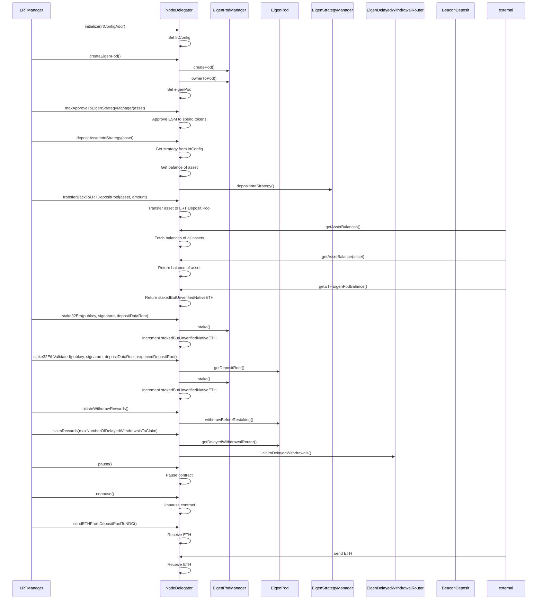
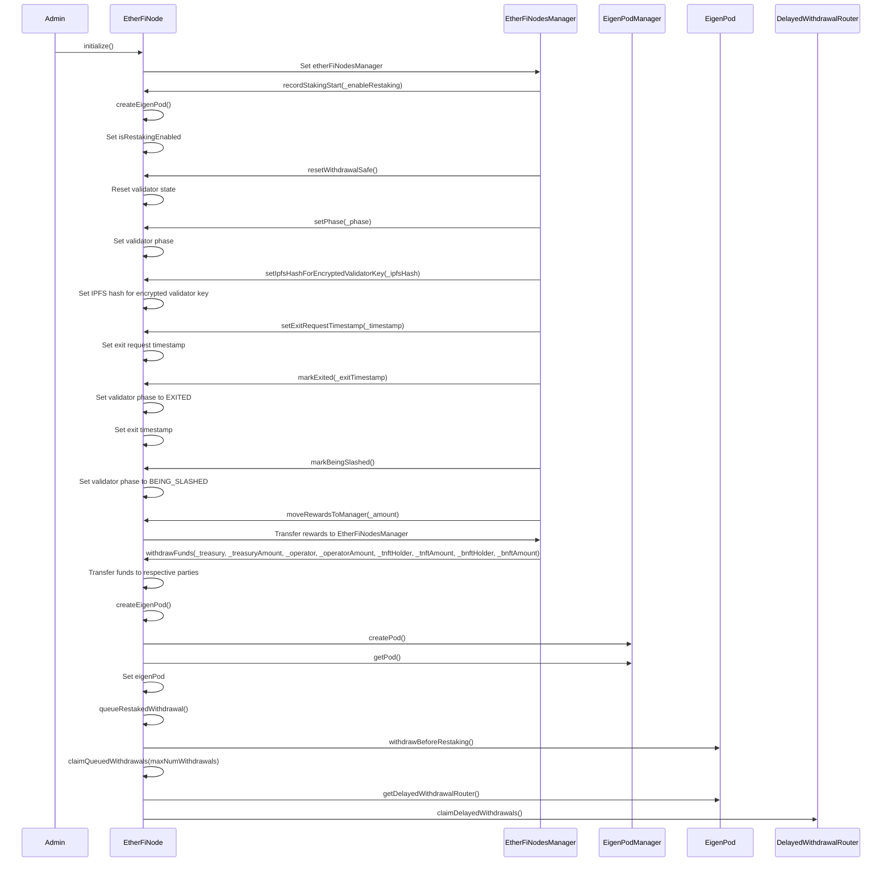

# Node Handling Architecture

The following document provides a general comparison of the key features and functionalities of the YieldNest, Renzo, Kelp, and Ether.Fi node handling contracts.

### General Comparison Table


| Feature                           | YieldNest                        | Renzo                            | Kelp                              | Ether.Fi                         |
|-----------------------------------|----------------------------------|----------------------------------|-----------------------------------|----------------------------------|
| Staking Mechanism                 | EigenPod-based staking           | Strategy-based staking           | EigenPod-based staking            | EigenPod-based staking           |
| Withdrawal Mechanism              | Supports pre-restaking withdrawals and delayed withdrawals | Supports queued withdrawals with strategies | Supports asset withdrawal and ETH restaking | Supports fund withdrawal to multiple parties |
| Delegation Management             | Delegation to operators          | Delegation to operators via DelegationManager | Not explicitly mentioned          | Not explicitly mentioned          |
| Strategy Management               | Strategy management for staking  | Strategy management via StrategyManager | Strategy management for asset deposits | Not explicitly mentioned          |
| Claiming Mechanism                | Claiming delayed withdrawals     | Not explicitly mentioned         | Claiming rewards and withdrawals  | Not explicitly mentioned          |
| Asset Management                  | Limited to staking-related assets | Supports multiple ERC20 tokens   | Comprehensive asset management    | Limited to staking-related assets |
| External Dependencies             | StakingNodesManager, StrategyManager, DelegationManager | RestakeManager, StrategyManager, DelegationManager | LRTManager, LRTAdmin, LRTOracle | EtherFiNodesManager, EigenPodManager |
| Reward Distribution               | RewardsDistributor for staking rewards | Reward forwarding to deposit queue | Not explicitly mentioned          | Rewards management for staking    |
| Validator State Management        | Supports resetting validator state | Not explicitly mentioned         | Not explicitly mentioned          | Supports phase transitions and resetting validator state |
| Contract Control                  | Not explicitly mentioned         | Pausing and unpausing contract   | Pausing and unpausing contract    | Not explicitly mentioned          |


## YeildNest
- Focuses on staking and withdrawal processes with a clear flow.
- Incorporates strategy management for asset handling.
- Utilizes delegation for flexible validator management.
- Provides mechanisms for claiming delayed withdrawals.
- Limited to staking-related functionalities.
- Lacks broader asset management capabilities beyond staking.

`StakeNode.sol`

```mermaid
sequenceDiagram
    participant A as Admin
    participant S as StakingNode
    participant SM as StakingNodesManager
    participant EP as EigenPod
    participant DM as DelegationManager
    participant SRM as StrategyManager
    participant DR as DelayedWithdrawalRouter

    %% Initialization %%
    A->>S: initialize()
    S->>SM: set stakingNodesManager
    S->>SRM: set strategyManager
    S->>S: set nodeId

    %% EigenPod Creation %%
    A->>S: createEigenPod()
    S->>SM: get eigenPodManager
    S->>EP: createPod()
    S->>EP: getPod()
    S->>S: set eigenPod
    S->>A: return eigenPod

    %% Withdrawal Before Restaking %%
    A->>S: withdrawBeforeRestaking()
    S->>EP: withdrawBeforeRestaking()

    %% Claim Delayed Withdrawals %%
    A->>S: claimDelayedWithdrawals(maxNumWithdrawals)
    S->>SM: get delayedWithdrawalRouter
    S->>DR: getUserDelayedWithdrawals()
    S->>DR: claimDelayedWithdrawals()

    %% Delegate %%
    A->>S: delegate(operator)
    S->>SM: get delegationManager
    S->>DM: delegateTo(operator)

    %% Verify Withdrawal Credentials %%
    A->>S: verifyWithdrawalCredentials()
    S->>EP: verifyWithdrawalCredentialsAndBalance()

    %% Start Withdrawal %%
    A->>S: startWithdrawal(amount)
    S->>SRM: queueWithdrawal()
    S->>S: emit WithdrawalStarted

    %% Complete Withdrawal %%
    A->>S: completeWithdrawal(params)
    S->>SRM: completeQueuedWithdrawal()
    S->>SM: processWithdrawnETH()

    %% Allocate Staked ETH %%
    SM->>S: allocateStakedETH(amount)
    S->>S: update totalETHNotRestaked

    %% Get ETH Balance %%
    A->>S: getETHBalance()
    S->>SRM: stakerStrategyShares()
    S->>A: return balance

    %% Implementation %%
    A->>S: implementation()
    S->>S: get beacon implementation
    S->>A: return implementation
  ```


## Renzo
- Supports multiple ERC20 tokens for delegation.
- Integrates with a RestakeManager for managing staking operations.
- Provides functionalities for depositing tokens into strategies and handling withdrawals.
- Allows for ETH staking and reward forwarding.
- Primarily focused on staking and token management, with less emphasis on other aspects of node operation.
- Dependent on external managers (RestakeManager, StrategyManager) for core functionalities.

`OperatorDelegator.sol`

```mermaid
sequenceDiagram
    participant A as Admin
    participant RM as RestakeManager
    participant OD as OperatorDelegator
    participant SM as StrategyManager
    participant DM as DelegationManager
    participant EPM as EigenPodManager
    participant EP as EigenPod

    %% Initialization %%
    A->>OD: initialize()
    OD->>OD: Set roleManager, strategyManager, restakeManager, delegationManager, eigenPodManager
    OD->>EPM: createPod()
    OD->>EPM: ownerToPod()
    OD->>OD: Set eigenPod

    %% Set Token Strategy %%
    A->>OD: setTokenStrategy(_token, _strategy)
    OD->>OD: Update tokenStrategyMapping
    OD->>OD: Emit TokenStrategyUpdated

    %% Set Delegate Address %%
    A->>OD: setDelegateAddress(_delegateAddress)
    OD->>DM: delegateTo(_delegateAddress)
    OD->>OD: Emit DelegationAddressUpdated

    %% Deposit Tokens %%
    RM->>OD: deposit(_token, _tokenAmount)
    OD->>OD: Transfer tokens to OD
    OD->>OD: Approve StrategyManager to spend tokens
    OD->>SM: depositIntoStrategy()
    OD->>RM: Return shares

    %% Get Strategy Index %%
    RM->>OD: getStrategyIndex(_strategy)
    OD->>SM: stakerStrategyListLength()
    OD->>SM: stakerStrategyList()
    OD->>RM: Return strategy index

    %% Start Withdrawal %%
    RM->>OD: startWithdrawal(_token, _tokenAmount)
    OD->>OD: Get nonce
    OD->>OD: Get strategy index
    OD->>OD: Convert tokens to shares
    OD->>SM: queueWithdrawal()
    OD->>OD: Emit WithdrawStarted
    OD->>RM: Return withdrawalRoot

    %% Complete Withdrawal %%
    RM->>OD: completeWithdrawal(_withdrawal, _token, _middlewareTimesIndex, _sendToAddress)
    OD->>SM: completeQueuedWithdrawal()
    OD->>OD: Transfer tokens to _sendToAddress

    %% Get Token Balance From Strategy %%
    RM->>OD: getTokenBalanceFromStrategy(token)
    OD->>OD: userUnderlyingView()
    OD->>RM: Return token balance

    %% Get Staked ETH Balance %%
    RM->>OD: getStakedETHBalance()
    OD->>OD: Return stakedButNotVerifiedEth + eigenPod.balance

    %% Stake ETH %%
    RM->>OD: stakeEth(pubkey, signature, depositDataRoot)
    OD->>EPM: stake()
    OD->>OD: Increment stakedButNotVerifiedEth

    %% Verify Withdrawal Credentials %%
    A->>OD: verifyWithdrawalCredentials()
    OD->>EP: verifyWithdrawalCredentialsAndBalance()
    OD->>OD: Decrement stakedButNotVerifiedEth

    %% Start Delayed Withdraw Unstaked ETH %%
    A->>OD: startDelayedWithdrawUnstakedETH()
    OD->>EP: withdrawBeforeRestaking()

    %% Handle ETH Received %%
    external->>OD: send ETH
    OD->>RM: Forward ETH to deposit queue
    OD->>OD: Emit RewardsForwarded
```

## Kelp
- Offers comprehensive asset management, including depositing assets into strategies and transferring assets back to pools.
- Supports ETH staking with validation and reward handling.
- Provides detailed asset balance information and TVL calculations.
- Incorporates pausing and unpausing functionalities for contract control.
- Complexity due to the extensive range of features and asset management capabilities.
- Potential for higher gas costs due to the increased number of interactions and transactions.

`NodeDelegator.sol`



## Ether.Fi
- Focuses on staking, withdrawal, and reward management.
- Supports restaking through EigenPod integration.
- Includes mechanisms for resetting validator states and handling phase transitions.
- Allows for detailed fund withdrawal to multiple parties.
- Limited to staking and fund management functionalities.
- Lacks broader asset management features found in some other contracts.

`EtherFiNode.sol`

