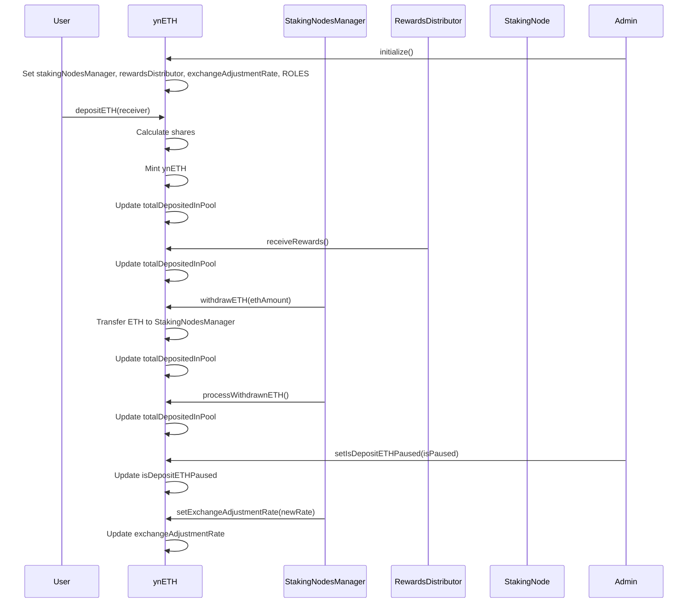
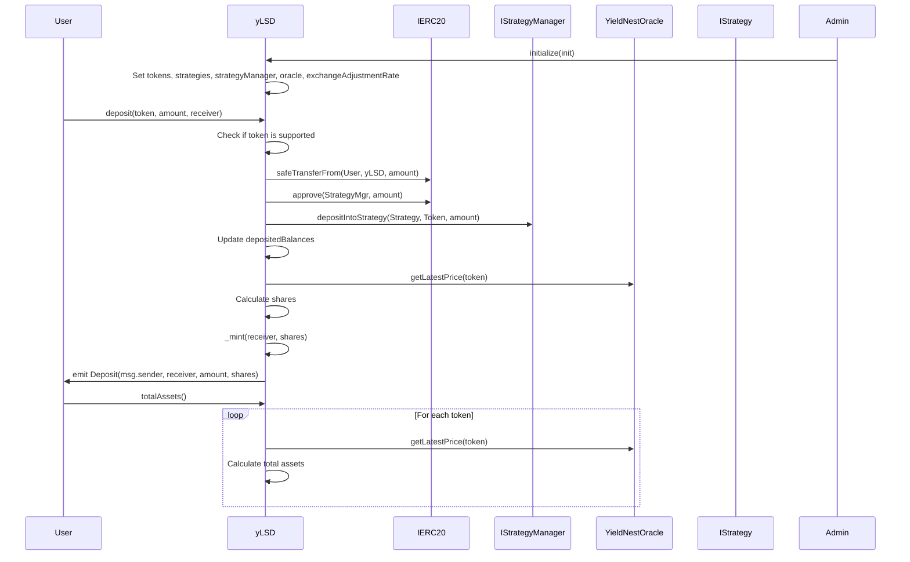
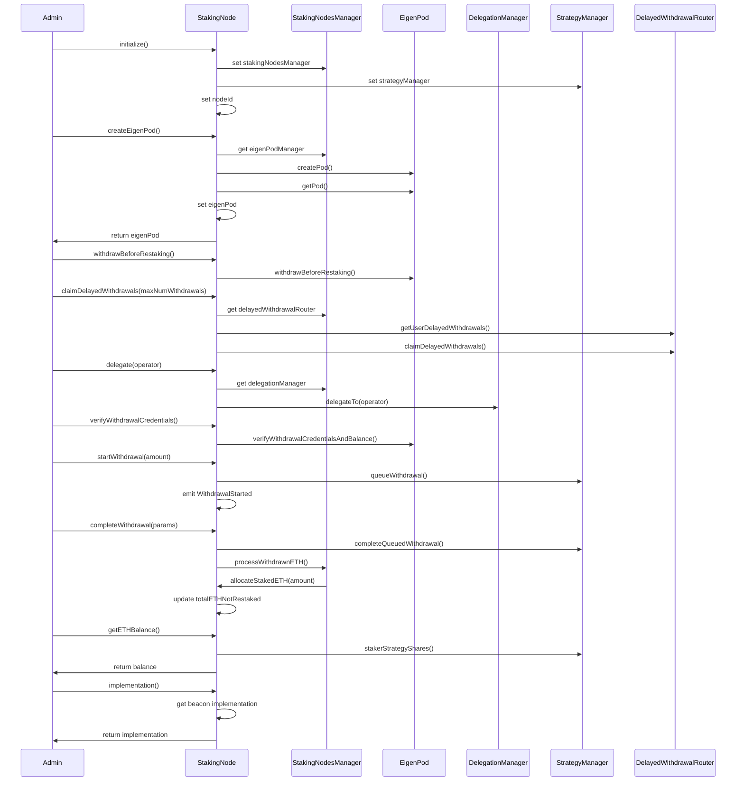
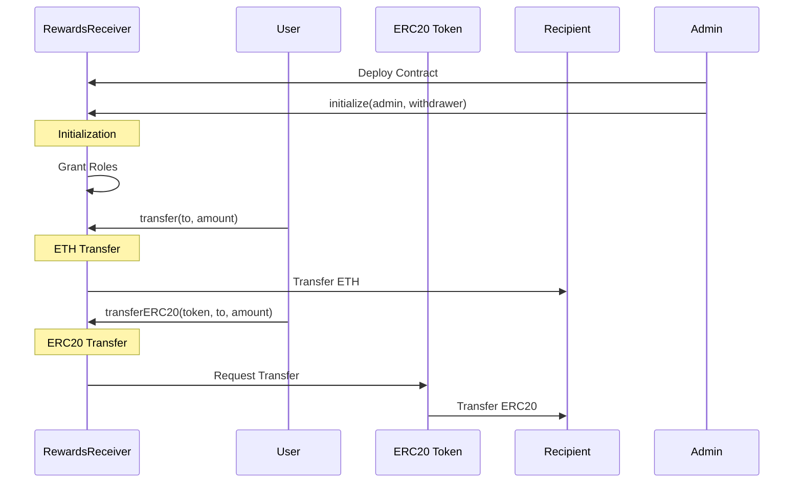
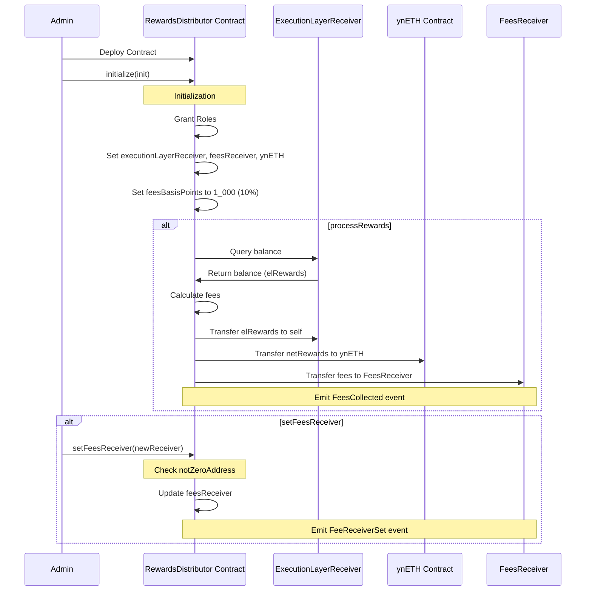
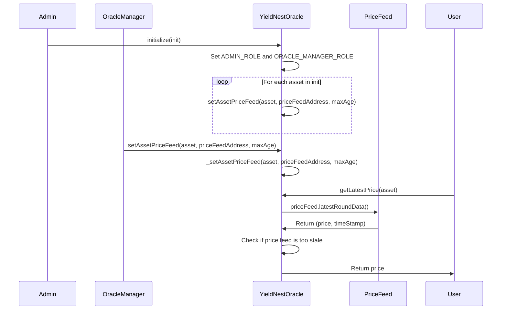

`ynETH.sol`


---
`ynLSD.sol`


---
`StakeNode.sol`


---
  `StakingNodesManager.sol`

  ```mermaid
  sequenceDiagram
    participant Admin as Admin
    participant SNM as StakingNodesManager
    participant DC as DepositContract
    participant Node as StakingNode
    participant EP as EigenPod

    %% Initialization %%
    Admin->>SNM: initialize()
    SNM->>SNM: Set roles, depositContract, eigenPodManager, ynETH, delegationManager, delayedWithdrawalRouter, strategyManager

    %% Receive ETH %%
    ynETH->>SNM: send ETH

    %% Register Validators %%
    Admin->>SNM: registerValidators(_depositRoot, _depositData)
    SNM->>SNM: Validate deposit data allocation
    loop For each depositData
        SNM->>SNM: Check if validator already used
        SNM->>SNM: Register validator
        SNM->>DC: deposit{value: _depositAmount}(publicKey, withdrawalCredentials, signature, depositDataRoot)
        SNM->>Node: allocateStakedETH(_depositAmount)
    end

    %% Create Staking Node %%
    Admin->>SNM: createStakingNode()
    SNM->>SNM: Check maxNodeCount
    SNM->>Node: initialize()
    Node->>Node: Set StakingNodesManager, strategyManager, nodeId
    Node->>Node: createEigenPod()
    Node->>EP: createPod()
    SNM->>SNM: Add node to nodes array

    %% Register Staking Node Implementation Contract %%
    Admin->>SNM: registerStakingNodeImplementationContract(_implementationContract)
    SNM->>SNM: Update upgradableBeacon

    %% Set Max Node Count %%
    Admin->>SNM: setMaxNodeCount(_maxNodeCount)
    SNM->>SNM: Update maxNodeCount

    %% Process Withdrawn ETH %%
    Node->>SNM: processWithdrawnETH(nodeId)
    SNM->>ynETH: processWithdrawnETH{value: msg.value}()

    %% Get All Validators %%
    User->>SNM: getAllValidators()
    SNM->>User: Return validators array

    %% Get All Nodes %%
    User->>SNM: getAllNodes()
    SNM->>User: Return nodes array

    %% Nodes Length %%
    User->>SNM: nodesLength()
    SNM->>User: Return nodes.length

    %% Is Staking Nodes Admin %%
    User->>SNM: isStakingNodesAdmin(_address)
    SNM->>User: Return hasRole(STAKING_NODES_ADMIN_ROLE, _address)
```
---
`RewardsReceiver.sol`


---
`RewardsDistributor.sol`


---
`YieldNestOracle.sol`

