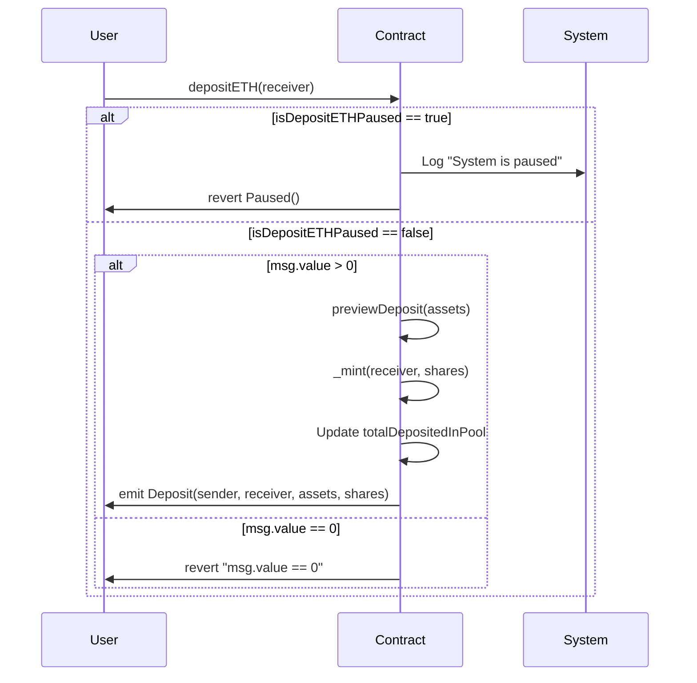

```mermaid
sequenceDiagram
    participant User
    participant Contract
    participant System

    User->>Contract: depositETH(receiver)
    alt isDepositETHPaused == true
        Contract->>System: Log "System is paused"
        Contract->>User: revert Paused()
    else isDepositETHPaused == false
        alt msg.value > 0
            Contract->>Contract: previewDeposit(assets)
            Contract->>Contract: _mint(receiver, shares)
            Contract->>Contract: Update totalDepositedInPool
            Contract->>User: emit Deposit(sender, receiver, assets, shares)
        else msg.value == 0
            Contract->>User: revert "msg.value == 0"
        end
    end
```