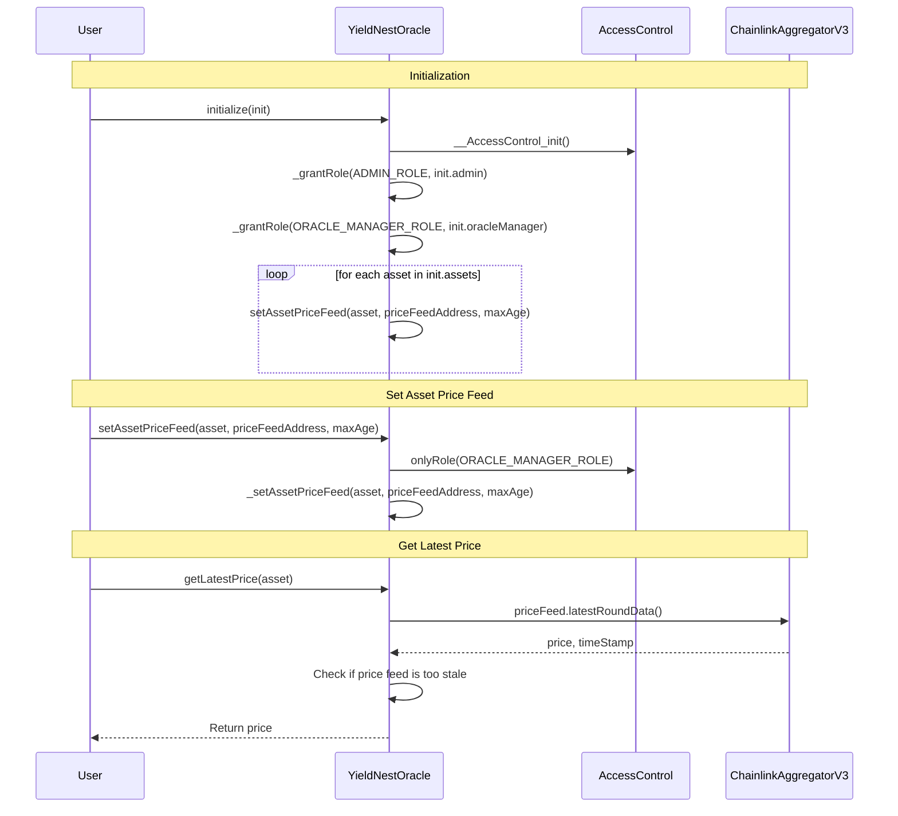

# YieldNest OracleReview

Review strategy process:

1. Review areas of YieldNest protocol for Oracle usage
2. Visualize Oracle usage flows
3. GPT Review
4. Identify potential security risks and areas for enhanced testing
5. Review External Audit Reports

---
`RewardsDistrubtor.sol`

Unused Code found on line 19: `error NotOracle();`

---
`StakingNode.sol`

The StakingNode uses the BeaconChain state root proofs from EigenLayer for verifying withdrawal credentials.

Potential security vulnerabilities to test for:

1. **Manipulation of Oracle Data:** If the oracle data (block numbers in this case) can be manipulated or if the source of the oracle data is not trustworthy, attackers could feed incorrect block numbers to influence the outcome of the verification process. This could potentially allow for the validation of incorrect or fraudulent withdrawal credentials.

2. **Replay Attacks**: Without proper checks, an attacker might reuse old oracleBlockNumber data in an attempt to pass the verification process with outdated information. This could be particularly problematic if the state of validators or their balances has changed since the oracle block number.

3. **Front-Running and Time Manipulation:** Given that block numbers are used as part of the verification process, there's a risk of front-running, where an attacker sees a transaction pending in the mempool and issues another transaction with a higher gas price to have it confirmed first. This could be used in conjunction with manipulating the timing or order of transactions to affect the outcome of the verification process.

Mitigations for these vulnerabilities include:
1. Ensuring the oracle providing the block numbers is secure, reliable, and resistant to manipulation.
2. Implementing checks to prevent the reuse of oracle data (e.g., nonce or timestamp checks).
3. Using mechanisms to protect against front-running, such as commit-reveal schemes or ensuring that the impact of transaction order is minimized.

---
`YieldNestOracle.sol`

The YeildNestOracle wraps the Chainlink V3 Aggregator to fetch prices.

1. **Visibility of Asset Price Feeds:** The assetPriceFeeds mapping is public, allowing anyone to query the set price feeds and their maxAge. This transparency is generally positive but should be considered in the context of the contract's overall security model.

2. **Data Type and Overflow Concerns:** The function handles an int256 price and a uint256 timestamp. Given the solidity version (^0.8.20), it is safe from overflow/underflow issues due to built-in checks. However, it's important to ensure that external systems interacting with this contract can handle int256 values correctly, especially if they expect positive values only.

3. **Access Control:** There's no access control for reading prices, which is appropriate for a public oracle. However, the broader contract should ensure that sensitive write operations (like updating price feeds or maxAge) are protected.

---
`ynETH.sol`

Line 15: Unused import `import "./interfaces/IOracle.sol";`

---
`ynLSD.sol`

### ynLSD.deposit

The deposit function uses an oracle to determine the price of a token in ETH before calculating the number of shares to mint. While the function includes some good security practices, such as using nonReentrant to prevent reentrancy attacks and checking for zero amounts, there are potential security issues related to the use of the oracle that need enhanced testing:

1. **Oracle Manipulation Risk:** The function relies on oracle.getLatestPrice(address(token)) to fetch the price of the deposited token in ETH. If the oracle is manipulated or provides inaccurate prices, it could lead to incorrect share calculations. This could be exploited by an attacker to mint more shares than they should be entitled to, based on the amount of the token they deposit.

2. **Integer Overflow and Underflow:** The calculation uint256(tokenPriceInETH) * amount / 1e18 assumes that the price is in 18 decimal places. However, if the price returned by the oracle is very high or the amount deposited is large, this calculation could overflow. Solidity 0.8.0 and above have built-in overflow/underflow protection, but it's still important to be aware of how these calculations are performed.

3. **Price Feed Reliability:** The reliability and update frequency of the oracle are crucial. If the oracle's price data is stale or not updated frequently, it may not accurately reflect the current market price, leading to potential arbitrage opportunities or losses for the protocol.

4. **Decimal Precision:** The division by 1e18 assumes that the price and the token amounts are both in 18 decimal places. This might not always be the case, especially with tokens that have different decimal places. This discrepancy can lead to precision loss in the calculation of tokenAmountInETH.

**Enchancement Options:**

1. **Use Multiple Oracles:** Consider using multiple oracles and aggregating their prices to mitigate the risk of manipulation or reliance on a single data source. This can help ensure that the price used is more robust and reliable.

2. **Implement Price Slippage Checks:** Introduce checks to ensure that the price from the oracle does not deviate significantly from a known average or from prices within a certain timeframe. This can help protect against oracle manipulation.

3. **Decimal Precision Handling:** Ensure that the contract correctly handles tokens with different decimal precisions. This might involve adjusting the calculation based on the token's decimals.

4. **Limit Maximum Deposit Amount:** To mitigate the risk of overflow and to ensure that the system can handle large deposits without significant impact on the share calculation, consider implementing a maximum deposit amount.

5. **Audit and Monitoring:** Regularly audit the oracle mechanism and monitor the oracle's price feeds for any signs of manipulation or failure. Quick response mechanisms should be in place to address any detected issues.

### ynLSD.totalAssets

