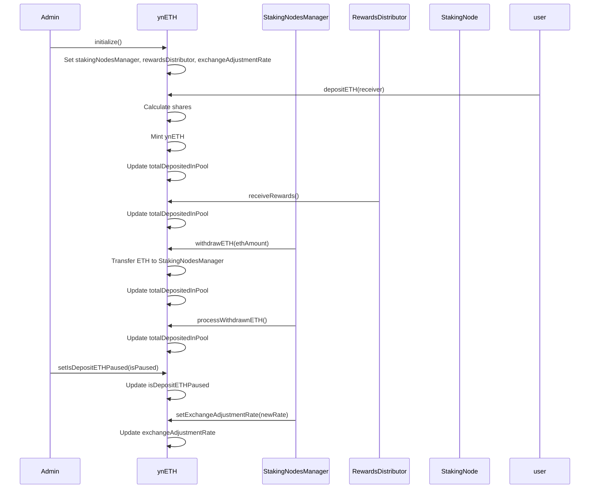
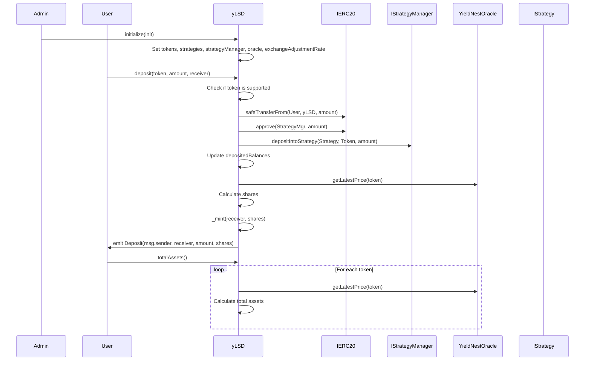
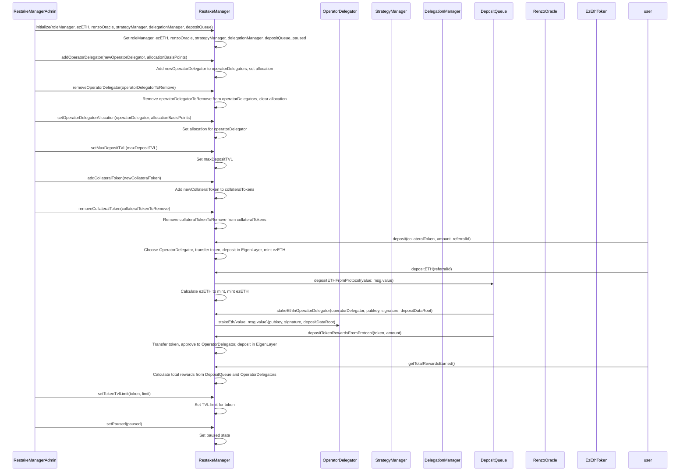
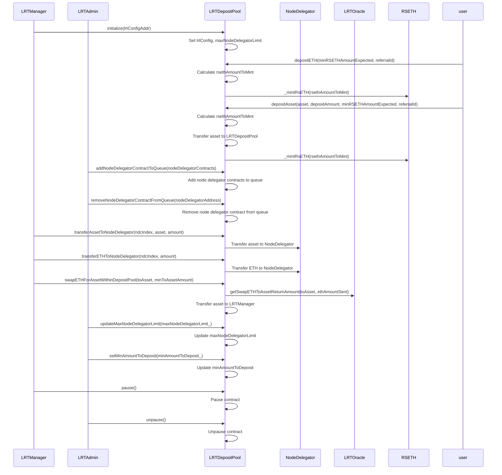
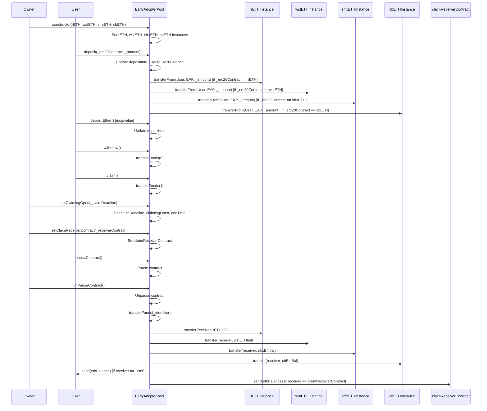

# Staking Architecture

The following document provides a general comparison of the key features and functionalities of the YieldNest, Renzo, Kelp, and Ether.Fi staking contracts.

### General Comparison Table
Here's a product comparison table for YieldNest (ynETH and ynLSD), Renzo, Kelp (LRTDepositPool), and EtherFi (EarlyAdopterPool):

| Feature                           | YieldNest                          | Renzo                              | Kelp (LRTDepositPool)              | EtherFi (EarlyAdopterPool)         |
|-----------------------------------|------------------------------------|------------------------------------|------------------------------------|------------------------------------|
| Supported Assets                  | Ethereum, LSD tokens               | Multiple collateral tokens         | ETH, other assets                  | Ethereum, selected ERC20 tokens    |
| Staking Rewards                   | Yes (through RewardsDistributor)   | Yes (based on staked assets)       | Not explicitly mentioned           | Yes (based on deposit duration and amount) |
| Rewards Distribution Mechanism    | RewardsDistributor contract        | Dynamic token TVL limits and OperatorDelegator allocations | Not explicitly mentioned           | Claiming process based on time and amount |
| External Dependencies             | StakingNodesManager, oracle        | StrategyManager, DelegationManager, DepositQueue, oracle | LRTOracle, RSETH, LRTManager, LRTAdmin | None mentioned                     |
| Pause Deposits                    | Yes                                | Yes                                | Not mentioned                      | Not mentioned                      |
| Exchange Rate Adjustment          | Yes                                | Not mentioned                      | Not mentioned                      | Not mentioned                      |
| Asset Swapping                    | Not mentioned                      | Not mentioned                      | Yes                                | Not mentioned                      |
| Operator Delegators               | Not mentioned                      | Yes                                | Yes                                | Not mentioned                      |
| TVL Limits                        | Not mentioned                      | Yes (per token)                    | Yes (max node delegator limit)     | Not mentioned                      |
| Centralization Concerns           | Dependency on external oracle      | Dependency on multiple external contracts and oracle | Dependency on LRTManager and LRTAdmin | Dependency on contract owner       |
| Claiming Process                  | Not mentioned                      | Not mentioned                      | Not mentioned                      | Time-sensitive with manual management |

# Staking Contract Comparison

## YieldNest
- Provides a decentralized staking solution for Ethereum and LSD tokens, allowing users to earn staking rewards.
- Implements a rewards distribution mechanism to incentivize users to stake their assets.
- Offers a way to pause deposits and adjust the exchange rate to manage the system's stability.
- Limited to Ethereum and specific LSD tokens, which may restrict the diversity of assets users can stake.
- The system's security and efficiency depend on the proper functioning of the StakingNodesManager and RewardsDistributor contracts.
- Relies on an external oracle for pricing information, which introduces a potential point of failure.

`ynETH.sol`

`ynLSD.sol`

## Renzo
- Provides a comprehensive staking solution with support for multiple collateral tokens.
- Includes a mechanism for distributing rewards to users based on their staked assets.
- Allows for dynamic adjustment of token TVL limits and OperatorDelegator allocations to manage the system's liquidity.
- Complexity of the contract increases the risk of bugs and vulnerabilities.
- Dependency on multiple external contracts (e.g., StrategyManager, DelegationManager, DepositQueue) can lead to potential integration issues.
- Relies on an external oracle for pricing information, similar to YieldNest.

`RestakeManager.sol`

## Kelp
- Supports deposits of both ETH and other assets, providing flexibility for users.
- Includes a mechanism for swapping ETH for other assets within the deposit pool.
- Allows for the addition and removal of NodeDelegator contracts to manage the staking process.
- Limited to the LRT ecosystem, which may restrict its adoption compared to more general-purpose staking solutions.
- The system's stability depends on the proper functioning of the LRTOracle and RSETH contracts.
- The contract's functionality is heavily reliant on the LRTManager and LRTAdmin roles, which could introduce centralization concerns.

`LRTDepositPool.sol`

## EtherFi
- Provides a simple and straightforward staking solution for Ethereum and selected ERC20 tokens.
- Allows users to claim rewards based on their deposit duration and amount, incentivizing long-term participation.
- Offers a mechanism for users to withdraw their funds or claim rewards to a designated contract.
- Limited to a predefined set of ERC20 tokens, which may restrict user participation.
- The claiming process is time-sensitive, which may disadvantage users who miss the claim deadline.
- Relies on manual management by the contract owner to set claim deadlines and receiver contracts, introducing potential centralization issues.

`EarlyAdopterPool.sol`

